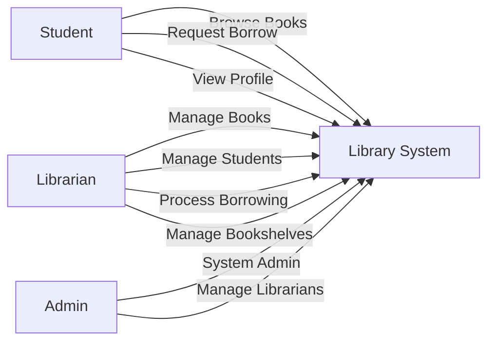
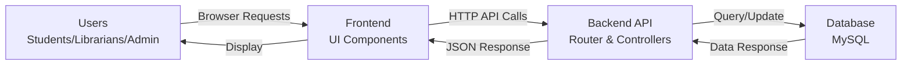
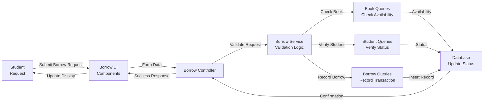
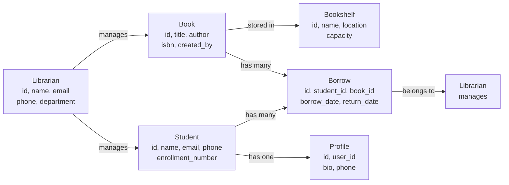

# Library-Management-Project

A comprehensive library management system built with Python backend and JavaScript frontend for efficient book, student, librarian, and borrowing management.

## Features
- Book Management
- Student Management
- Librarian Management
- Book Shelves Organization
- Borrowing System
- Profile Management

---

## Diagrams

### Use Case Diagram

### Dataflow 0 (Context Diagram)

### Dataflow 1 (Detailed System Flow)

```mermaid
graph LR
    Client["Client Application"]
    Router["Router Module"]
    Controller["Controllers<br/>Library Controller"]
    Service["Services<br/>Book/Student/Borrow Service"]
    Query["Database Queries<br/>Query Handlers"]
    Database["Database<br/>Tables"]
    
    Client -->|HTTP Request| Router
    Router -->|Route to Handler| Controller
    Controller -->|Business Logic| Service
    Service -->|Execute Query| Query
    Query -->|SQL Query| Database
    Database -->|Result Set| Query
    Query -->|Data Object| Service
    Service -->|Processed Data| Controller
    Controller -->|Response Object| Router
    Router -->|JSON Response| Client
```

### Dataflow 2 (Borrowing Process Flow)

### Entity Relationship Diagram
